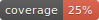

[](https://twitter.com/gabefoley)
# ASR Curation workflow


<p align="center">
	

</p>

Snakemake pipeline for annotating sequences to be used in ancestral sequence reconstruction.

Most of the fun stuff is inside the `asr_curation` folder.

# Basic concept

A common task in phylogenetics and ancestral sequence reconstruction to have a large set of data you are interested in with the need to curate this data to include only relevant sequences. 

This pipeline starts by allowing the user to submit a large set of sequences (in a single FASTA file) and then to also create a set of 'rules' by which the data should be split up - which sequences to include in downstream phylogenetic analyses, based on the metadata that is retrieved, by this pipeline, from the UniProt and BRENDA databases.

As phylogenetic analysis is an iterative process that benefits from a deep understanding of the underlying sequences, these annotations can be viewed in interactive notebooks generated by Jupyter-book, and further sets of rules can be created in .subset files to create alternative subsets of the data.

Because this is executed within a snakemake pipeline, it has the added advantage of keeping all the iterations of subsets available and the rules that exclude sequences clearly defined and therefore entirely reproducible. 


# Install instructions 


1. Clone this repository to your desktop

```
git clone https://github.com/gabefoley/asr_curation.git
```


2. Create a conda environment

```
conda env create -n asr_curation python=3.9
```

3. Activate the conda environment

```
conda activate asr_curation
```

4. Install the required Python packages

```
pip install -r requirements.txt
```


5. Install the following so that they are callable from the command line
- [mafft](https://mafft.cbrc.jp/alignment/software/) - callable as `mafft`
- [FastTree](http://www.microbesonline.org/fasttree/) - callable as `FastTree`
- [GRASP](https://bodenlab.github.io/GRASP-suite/project/graspcmd/) - callable as `grasp`


Optional (for viewing trees with generated annotation files)

- [FigTree](http://tree.bio.ed.ac.uk/software/figtree/)


# Running the example pipeline

To run a pipeline we need to define a config file, a fasta file, and a subset file


Run the example snakemake pipeline with the default configs defined in `example_config.yaml`

The output here has already been generated. If you want to rerun this pipeline you can first delete the folder and all items stored in `./asr_curation/workflows/example_workflow/datasets`


Then you can run

```
snakemake --cores 1 --configfile ./asr_curation/config/example_config.yaml

```


This example workflow starts with two data sets for ALS and KARI, retrieves annotations from UniProt, and creates subsets of the data based on the rules defined in each `subset` file in `example_workflow/subset_rules`

There are two subsets defined for the KARI sequences and one subset defined for the ALS sequences.

The pipeline requires you to be online and takes around 5 minutes to complete.

The full pipeline as defined in `snakefile` for the example workflow is displayed below.

<p align="center">
	

</p>

The generated summary documents can be found in the following locations

`./asr_curation/workflows/example_workflow/datasets/kari_example_ec_1_1_1_86/dataset_summary/eukaryotic_kari/_build/html/index.html`


`./asr_curation/workflows/example_workflow/datasets/als_example_ec_2_2_1_6/dataset_summary/als_interpro_IPR012782/_build/html/index.html`


# Output files

Quick note: More of these folders are being kept then are required (specifically the ones relating to building the summary documents, as it is currently useful for debugging purposes).

## Key output folders are described for the KARI data set in the example workflow (`kari_example_ec_1_1_1_86`)


<p align="center">
	

</p>


# Folder explanation

- config - Store config files here

- notebooks - Jupyter notebooks that are run to generate the summary documents

- scripts - The key Python scripts used in the pipeline

- static  - Static images

- workflows - Stores the example workflow that contains data after pipeline is finished


# Config files

Config files should define -

`workdir` - the main working directory

`fastadir` - the directory where all FASTA files are stored. Each separate FASTA file will be run independently through the pipeline.

`subdir` - the directory where all the ways we want to subset the sequences are stored. One subset file for each FASTA file that should be named equivalently (i.e. if you have a test1.fasta file in the `fastadir` you need a `test1.subset` file in the `subdir`)

`annotation_cols` - defines which columns are used in the summary documents to generate charts, and also adds them to an `annotations.txt` file which can be used to interactively view annotations in [FigTree](http://tree.bio.ed.ac.uk/software/figtree/)

`blocked_datasets` - stops the pipeline from being run on a specific pair of FASTA files / subset files. For example, adding `test1` to this list stops `test1.fasta` and `test1.subset` from being run.


# Where do I place the config files?

To keep this repository clean, because it is still being developed - I suggest placing the folders with your data outside this repository and pointing the snakemake call to them.

You can then capture the stderr and stdoutput, which will contain all of the snakemake run information and save it to a file located with your data.

`&>` will overwrite the output file and `&>>` will append to the end of the output file

`snakemake --cores 1 --configfile <path/to/data_folder/config/config.yaml> &>><path/to/data_folder/logs/output_log.txt>`

If you don't want to save the log then you can just call snakemake as above without the call to save the log and the snakemake output will print to the screen as normal and your data will still be saved in your `data_folder`


# Subset files

Subset files need to be in the format 

`<subset_name> = <column_name> : <string> $ <other_column_name> : NOT <string>`

Where `subset_name` can be any name you wish to call the subset, `column_name` and `other_column_name` are columns that appear in the final annotation file (see /csv/custom/*.csv) and `string` is a term that you wish to include or exclude.

For each row / sequence in your annotation file, if the given column contains the string (or substring) then it will be included.

If you use the `NOT` modifier, for each row / sequence in your annotation file, if the given column contains the string (or substring) then it will not be included.


The default way to include every row / sequence is 

`<subset_name> = *`

For example,

`all = *`  

See the subset files in the example data for full examples.

# Snakemake tips

1. Force snakemake to keep going with all non-dependent tasks even after it encounters failure with -k


# Jupyter notebooks

1. If you start a notebook from within an activated conda environment, you can change open a notebook and have access to the underlying Python environment with all installed packages. If this doesn't load automatically for you, you can open a notebook and select Cell > Change kernel > 'Python 3 (ipykernel)'


