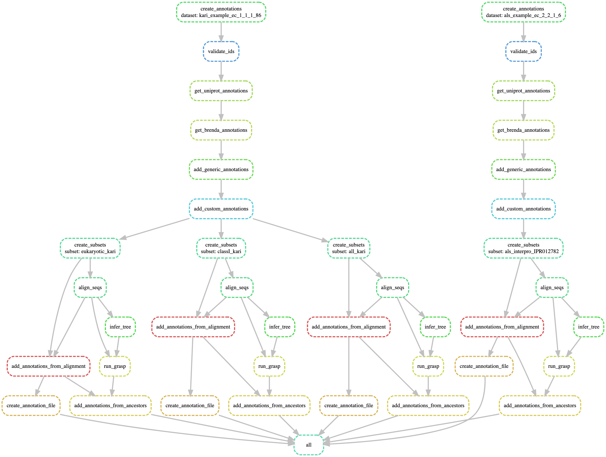

## **Snakemake diagram**
The following diagram is the overall steps that have to be run by `snakemake` to generate the example data.

!!! note "Diagram"
    Note that in this case, the KARI data had three subsets defined, so `create_subsets` and all of the other steps downstream from this step are run three times, while the ALS data only has one subset defined and so `create_subsets` is only run once.

## **Explanation of steps**

The following section explains all of the steps defined in the `snakefile` and explains broadly what they are doing, as well as the inputs and outputs.

A link to the exact output as per the example workflow in the `asr_curation` repository is also provided.

## **1. Create the annotation files**

### **create_annotations**

Create the initial annotations file from a FASTA file containing sequences

!!! note "Input / Output / Example output file"
    * ***Input**  - FASTA file*
    * ***Output** -*
    * ***Example output file from `example_workflow`  -***

### **validate_ids**

Use UniProt to validate the IDs that are present in the FASTA file and map between UniProt, NCBI, EMBL identifiers

### **get_uniprot_annotations**

Use the validated UniProt ID to retrive all of the annotations available for all of the sequences 

### **get_brenda_annotations**

Use the EC Number to get the BRENDA annotations available for any of the sequences.

Currently this requires the EC number/s to be hard coded in the original FASTA file. 

### **add_generic_annotations**

Update the annotations file to contain generic annotations that are useful for all datasets - such as whether the sequence has non-amino acid characters

### **add_custom_annotations**

Update the annotations file to add any custom annotations for your specific dataset. The location of add_custom_annotations.py can be set in the config file to allow for custom annotations.

## **2. Make subsets of the data**

### **create_subsets**

Based on the subsets defined in the `subset` file, segment the data into multiple subsets. As this step comes after the 
retrieval of annotations from UniProt and after the custom annotations these subset rules can refer to information from either of these steps.

Steps 3 onwards will then be carried out for each defiend subset.

## **3. Align subsets, infer trees, predict ancestors**

### **align_seqs**

Align the sequences identified in a subset.

### **infer_tree**

Infer a phylogenetic tree from the alignment identified in a subset

### **run_grasp**

Predict ancestors using a phylogenetic tree and alignment identified in a subset.

## **4. Add annotations derived from alignment and ancestors**

### **add_annotations_from_alignment**

### **add_annotations_from_ancestors**

## **5. Create annotation file (for FigTree viewing) and summary Jupyter notebooks**

### **create_annotation_file**

### **create_dataset_summary**

### **clean_summary_document**

### **create_subset_summary**

### **create_subset_document**

### **compile_summary_document**

### **concat_ancestor_alignment**

rule create_annotations:
    input:
        FASTADIR + "/{dataset}.fasta"
    output:
        WORKDIR + "/{dataset}/csv/original/{dataset}_original.csv"
    script:
        "scripts/create_annotations.py"

# Map the IDs to UniProt and NCBI in order to validate the type of IDs they are
rule validate_ids:
   input:
       WORKDIR + "/{dataset}/csv/original/{dataset}_original.csv"
   output:
       WORKDIR + "/{dataset}/csv/validated/{dataset}_validated.csv"
   script:
       "scripts/validate_ids.py"

# Map to UniProt to get all of the known UniProt annotations
rule get_uniprot_annotations:
    input:
        WORKDIR + "/{dataset}/csv/validated/{dataset}_validated.csv"
    output:
        WORKDIR + "/{dataset}/csv/uniprot/{dataset}_uniprot.csv"
    script:
        "scripts/get_uniprot_annotations_pagination.py"

# # # Map the UniProt sequences to IDs we can query IPG with, and then query IPG to add genome information
# rule get_genomes:
#     input:
#         WORKDIR + "/{dataset}/csv/uniprot/{dataset}_uniprot.csv"
#     output:
#         WORKDIR + "/{dataset}/csv/genome/{dataset}_genome.csv"
#         #WORKDIR + "/{dataset}/csv/gtdb_processed/{dataset}_gtdb_processed.csv"
#     script:
#         "scripts/get_genomes.py"

# # Map the Genomes to GTDB
# rule get_gtdb_annotations:
#    input:
#        WORKDIR + "/{dataset}/csv/genome/{dataset}_genome.csv"
#    output:
#        WORKDIR + "/{dataset}/csv/gtdb/{dataset}_gtdb.csv"
#    script:
#        "scripts/get_gtdb_annotations.py"

# #Use GTDB to cross-check CheckM scores and GTDB taxonomy
# rule process_gtdb_annotations:
#    input:
#        WORKDIR + "/{dataset}/csv/gtdb/{dataset}_gtdb.csv"
#    output:
#        WORKDIR + "/{dataset}/csv/gtdb_processed/{dataset}_gtdb_processed.csv"
#    script:
#        "scripts/process_gtdb_annotations.py"

# Map to BRENDA database to get all of the known BRENDA annotations
rule get_brenda_annotations:
    input:
        WORKDIR + "/{dataset}/csv/uniprot/{dataset}_uniprot.csv"
        # WORKDIR + "/{dataset}/csv/gtdb_processed/{dataset}_gtdb_processed.csv"
    output:
        WORKDIR + "/{dataset}/csv/brenda/{dataset}_brenda.csv"
    script:
        "scripts/get_brenda_annotations.py"

# Add any generic annotations
rule add_generic_annotations:
    input:
        WORKDIR + "/{dataset}/csv/brenda/{dataset}_brenda.csv"
    output:
        WORKDIR + "/{dataset}/csv/custom/{dataset}_generic_annotated.csv"
    script:
        "scripts/generic_annotations.py"

# Add any custom annotations
rule add_custom_annotations:
    input:
        WORKDIR + "/{dataset}/csv/custom/{dataset}_generic_annotated.csv"
    output:
        WORKDIR + "/{dataset}/csv/custom/{dataset}_annotated.csv"
    script:
        CUSTOM_DIR + "/custom_annotations.py"

# Create the su
rule create_column_summary_images:
    input:
        WORKDIR + "/{dataset}/csv/custom/{dataset}_annotated.csv"
    output:
        img = WORKDIR + "/{dataset}/col_images/{dataset}_brenda.png"
    script:
        "scripts/get_column_summary_images.py"

rule create_subsets:
    input:
        rules=SUBDIR + "/{dataset}.subset",
        csv=WORKDIR + "/{dataset}/csv/custom/{dataset}_annotated.csv"
    output:
        fasta = WORKDIR + "/{dataset}/subsets/{subset}/{dataset}_{subset}.fasta",
        csv = WORKDIR + "/{dataset}/subsets/{subset}/csv/{dataset}_{subset}.csv"
    script:
        "scripts/create_subsets.py"

rule align_seqs:
    input:
        WORKDIR + "/{dataset}/subsets/{subset}/{dataset}_{subset}.fasta"
    output:
        WORKDIR + "/{dataset}/subsets/{subset}/{dataset}_{subset}.aln"
    shell:
        "mafft --reorder {input} > {output}"

rule infer_tree:
    input:
        WORKDIR + "/{dataset}/subsets/{subset}/{dataset}_{subset}.aln"

    output:
        WORKDIR + "/{dataset}/subsets/{subset}/{dataset}_{subset}.nwk"

    shell:
        "FastTree {input} > {output}"

rule run_grasp:
    input:
        aln= WORKDIR + "/{dataset}/subsets/{subset}/{dataset}_{subset}.aln",
        tree= WORKDIR + "/{dataset}/subsets/{subset}/{dataset}_{subset}.nwk"

    output:
        dir= directory(WORKDIR + "/{dataset}/subsets/{subset}/grasp_results/"),
        aln= WORKDIR + "/{dataset}/subsets/{subset}/grasp_results/GRASP_ancestors.fa",
        tree = WORKDIR + "/{dataset}/subsets/{subset}/grasp_results/GRASP_ancestors.nwk"

    shell:
        "grasp -a {input.aln} -n {input.tree} -s LG -o {output.dir} -i BEP -j --save-as FASTA TREE -pre GRASP -t 2"

rule add_annotations_from_alignment:
    input:
        aln= WORKDIR + "/{dataset}/subsets/{subset}/{dataset}_{subset}.aln",
        csv = WORKDIR + "/{dataset}/subsets/{subset}/csv/{dataset}_{subset}.csv"
    output:
        csv = WORKDIR + "/{dataset}/subsets/{subset}/csv/{dataset}_{subset}_alignment.csv"

    script:
        CUSTOM_ALIGN_DIR + "/add_annotations_from_alignment.py"

rule add_annotations_from_ancestors:
    input:
        csv = WORKDIR + "/{dataset}/subsets/{subset}/csv/{dataset}_{subset}_alignment.csv",
        aln = WORKDIR + "/{dataset}/subsets/{subset}/grasp_results/GRASP_ancestors.fa",
    output:
        csv = WORKDIR + "/{dataset}/subsets/{subset}/csv/{dataset}_{subset}_ancestors.csv"
    script:
        CUSTOM_ANCESTOR_DIR + "/add_annotations_from_ancestors.py"

rule create_annotation_file:
    input:
        csv = WORKDIR + "/{dataset}/subsets/{subset}/csv/{dataset}_{subset}_alignment.csv"

    params:
        annotation_cols = config['annotation_cols']
    output:
        tsv = WORKDIR + "/{dataset}/subsets/{subset}/csv/{dataset}_{subset}_annotations.txt"
    script:
        "scripts/create_annotation_file.py"

# Rules for creating the PDF summary files

rule create_dataset_summary:
    input:
       WORKDIR + "/{dataset}/csv/custom/{dataset}_annotated.csv",
    params:
        annotation_cols = config['annotation_cols']
    output:
       summary = WORKDIR + "/{dataset}/dataset_summary/temp/{dataset}_summary.ipynb",
       # dir = directory(WORKDIR + "/{dataset}/dataset_summary")

    log:
       # optional path to the processed notebook
       notebook=WORKDIR + "/{dataset}/dataset_summary/temp/{dataset}_summary.ipynb"
    notebook:
       "notebooks/create_summary_document.py.ipynb"

#Hide the first cell that snakemake adds to the notebook
rule clean_summary_document:
   input:
       WORKDIR + "/{dataset}/dataset_summary/temp/{dataset}_summary.ipynb"
   output:
       WORKDIR + "/{dataset}/dataset_summary/{dataset}_summary_cleaned.ipynb"

   script:
       "scripts/clean_summary_document.py"

rule create_subset_summary:
    input:
       aln= WORKDIR + "/{dataset}/subsets/{subset}/{dataset}_{subset}.aln",
       csv = WORKDIR + "/{dataset}/subsets/{subset}/csv/{dataset}_{subset}_alignment.csv"

    params:
        annotation_cols = config['annotation_cols']

    output:
       summary = WORKDIR + "/{dataset}/dataset_summary/{dataset}/subsets/{subset}/temp/{subset}_subset_summary.ipynb",
    log:
        #optional path to the processed notebook
       notebook=WORKDIR + "/{dataset}/dataset_summary/{dataset}/subsets/{subset}/temp/{subset}_subset_summary.ipynb"
    notebook:
       "notebooks/create_subset_document.py.ipynb"

#Hide the first cell that snakemake adds to the notebook
rule clean_subset_summary:
   input:
       summary = WORKDIR + "/{dataset}/dataset_summary/{dataset}/subsets/{subset}/temp/{subset}_subset_summary.ipynb",
   output:
       summary = WORKDIR + "/{dataset}/dataset_summary/{dataset}/subsets/{subset}/{subset}_subset_summary_cleaned.ipynb",

   script:
       "scripts/clean_summary_document.py"

        #expand("indelible_summaries/{{taxon}}/{rep}.csv", rep = [x for x in range(1, config['REPS'] + 1)])
rule create_subset_document:
   input:
       pdf = WORKDIR + "/{dataset}/dataset_summary/{dataset}_summary_cleaned.ipynb",
       subsets = WORKDIR + "/{dataset}/dataset_summary/{dataset}/subsets/{subset}/{subset}_subset_summary_cleaned.ipynb"
       # subsets = expand(WORKDIR + "/{{dataset}}/dataset_summary/{{dataset}}/subsets/{subset}/temp/{subset}_summary.ipynb", subset = [subset for subset in subsets[{{wildcards.dataset}}]])
   output:
       config = WORKDIR + "/{dataset}/dataset_summary/{subset}/_config.yml",
       toc = WORKDIR + "/{dataset}/dataset_summary/{subset}/_toc.yml"

   script:
       "scripts/create_summary_document.py"

rule compile_summary_document:
   input:
       # dir = WORKDIR + "/{dataset}/dataset_summary",
       config = WORKDIR + "/{dataset}/dataset_summary/{subset}/_config.yml"

   params:
       dir = WORKDIR + "/{dataset}/dataset_summary/{subset}",
   output:
      config = WORKDIR + "/{dataset}/dataset_summary/{subset}/_build/html/index.html"
   shell:
       "jb build {params.dir}"

rule concat_ancestor_alignment:
    input:
        extants = WORKDIR + "/{dataset}/subsets/{subset}/{dataset}_{subset}.aln",
        ancestors = WORKDIR + "/{dataset}/subsets/{subset}/grasp_results/GRASP_ancestors.fa",

    output:
        WORKDIR + "/{dataset}/subsets/{subset}/concatenated_seqs/{dataset}_{subset}_ancestors.aln"
    shell:
        "cat {input.extants} {input.ancestors} > {output}"

# rule create_ancestor_image:
#     input:
#         tree = WORKDIR + "/{dataset}/subsets/{subset}/grasp_results/GRASP_ancestors.nwk",
#         aln = WORKDIR + "/{dataset}/subsets/{subset}/concatenated_seqs/{dataset}_{subset}_ancestors.aln",
#         csv = WORKDIR + "/{dataset}/subsets/{subset}/csv/{dataset}_{subset}_ancestors.csv"
#     output:
#         img = "{WORKDIR}/{dataset}/subsets/{subset}/ancestor_images/{anc_col}/{anc_val}.png"
#     script:
#         "scripts/create_ancestor_images.py"

# rule create_tree_image:
#     input:
#         tree = WORKDIR + "/{dataset}/subsets/{subset}/{dataset}_{subset}.nwk",
#         aln = WORKDIR + "/{dataset}/subsets/{subset}/{dataset}_{subset}.aln",
#         csv = WORKDIR + "/{dataset}/subsets/{subset}/csv/{dataset}_{subset}_ancestors.csv"

#     output:
#         WORKDIR + "/{dataset}/subsets/{subset}/tree_images/{column}.png"
#     # output:
#     #     expand(WORKDIR + "/{dataset}/tree_images/{dataset}_{column}.png",
#     #         dataset=DATASETS,
#     #         column=config['annotation_cols'])
#     shell:
#         "python scripts/tree_annot.py -t {input.tree} -a {input.aln} -c {input.csv} --col '{wildcards.column}' --match_from 'Entry' -r 4425 -o {output}"

# Reading snakemake files
