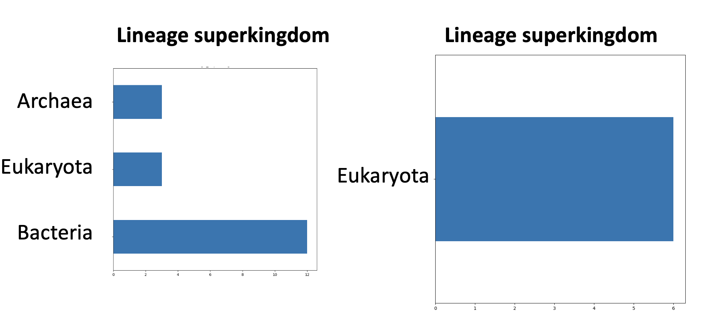

## **ASR curation overview**
<figure markdown>
  { width="400" }
</figure>

ASR curation is a snakemake pipeline for annotating sequences to be used in ancestral sequence reconstruction.

It implements a re-runnable workflow of all the basic steps of a reconstruction -

- sequence alignment 
- tree inference
- ancestral prediction

The focus is on building up a series of annotation files for all of the sequences in your dataset.

The columns in these alignment files are used to subset the data by defining a series of rules including or excluding sequences.

The annotations can be further used to visualise your data on phylogenetic trees and within sequence alignments.

<figure markdown>
  { width="700" }
  <figcaption>Figure 1: Overview of ASR curation.</figcaption>

</figure>

## **Subsets**
A single dataset can have many subsets. 

From Figure 1, there is one defined dataset (step 1) and so a master annotation file is built once (step 2). There are three defined subsets (step 3) and so alignment, tree inference, and ancestor prediction occurs three times - once per subset (step 4) resulting in three trees (step 5).
This Figure defines three subsets (step 3) and so three trees are produced (step 5).

Annotations can also be added after the alignment and ancestor stage, but currently these are just used for visualisation purposes, not for curation.

The focus on subset rule files means that you can -

- create many different subsets at once and 
- have a list of understandable and reproducible rules for curating your data 

## **Documentation overview**

- **Installation and quickstart** 
     - *Installation -* Shows how to install `asr_curation` locally and what files and commands run the pipeline. 
     - *Running example data -* Explains how to run the example data to verify the pipeline is working correctly 
     - *Explanation of output -* Shows what each of the output folders contain after running the example data
- **Detailed explanation** 
     - *Basic snakemake -* A quick introduction to key snakemake concepts and how to read the steps defined in the `snakefile`  
     - *Explanation of steps -* A detailed rundown of what each step within the `asr_curation` pipeline is doing 
- **Customisation** 
     - *Defining files -* How to define the `config` and `subset` files so that you can run the `asr_curation` pipeline on your data 
     - *Customising workflows -* How to customise the workflow by adding custom annotations to be added to each dataset

## **Cool features**

The focus on annotations allows us to directly visualise these annotations -

<figure markdown>
  { width="400" }
  <figcaption>Figure 2: Domains automatically retrieved from UniProt and overlaid on an alignment.</figcaption>

</figure>

<figure markdown>
  { width="400" }
  <figcaption>Figure 3: All annotations can be added to custom annotation files viewable in FigTree</figcaption>

</figure>

<figure markdown>
  { width="400" }
  <figcaption>Figure 4: Patterns of specific annotations can be viewed across subsets.</figcaption>

</figure>