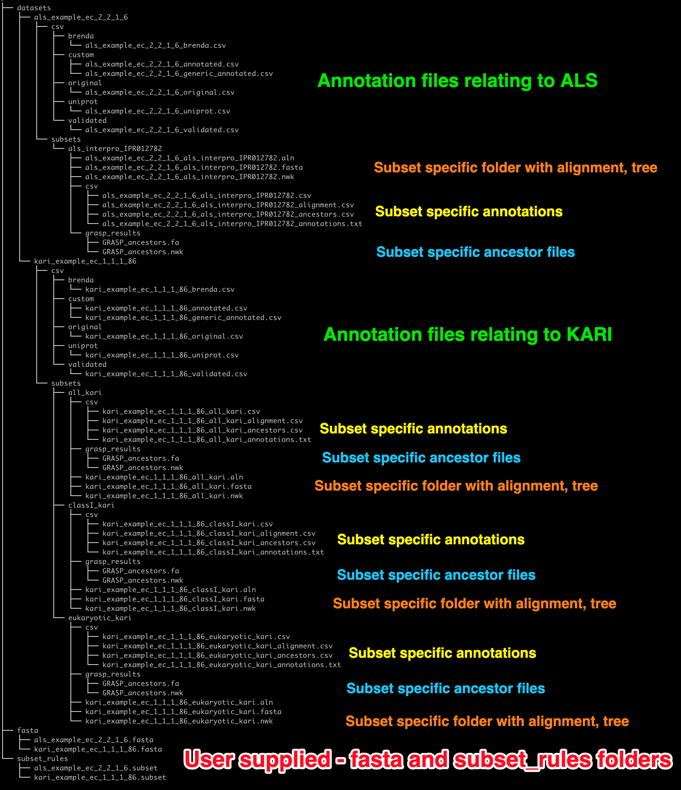

## **Explanation of output**

The following image shows the directory structure of the output directories after running the example data.

Remember that the example workflow defined two datasets - one with three subsets, and one with a single subset.

Hence the output directories contain 

- the original `fasta` and `subset` directories (red)
- annotation files that are built for each dataset (green)
- subset specific alignment and tree files (orange)
- subset specific annotation files (yellow)
- subset specific ancestor files (blue)

<figure markdown>

  <figcaption>Output directory structure of example data</figcaption>
</figure>

